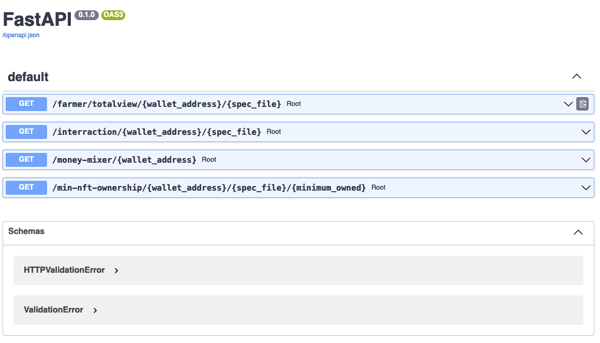

# Sybil Defense Components

The repository contains function components that can be used to gather
information about any wallet address. The information can be used to decide
whether an address is likely to be a sybil or not and to create defense
mechanisms against [sybil attacks](https://en.wikipedia.org/wiki/Sybil_attack),
which can affect governance voting, in quadratic funding, etc. on blockchains.

Each component (a "lego") can be used by itself to provide information about
a wallet address without depending on the other components. The output of
multiple components can be used to make decisions about whether a specific
address refers to a single person or it's a sybil.

Since there is no clear cut case of how any particular sybil behaves, since
the behavior can change over time to adapt to current defense strategies,
the information provided by the provided components might not be enough to
decide on whether an address belongs to a sybil or not.

The components interact with and fetch data from the Ethereum blockchain.

The current codebase uses the:
- [Alchemy API](https://www.alchemy.com/)
- [CoinGecko API](https://www.coingecko.com/en/api/documentation)

To use the Alchemy API you will need to provide a key as an environment
variable `ALCHEMY_API_KEY` which can be obtained free from the Alchemy's
website.

## Overview

There are two ways to use the current repository:
1. The `src/` directory contains a set of modules that can be used by independently
to provide information about a wallet address by examining data on the blockchain.
2. The `docker-compose.yml` can be used to start a server which provides endpoints
that can be called by a client service. In turn, the endpoints invoke the
components from the `src/` directory and they return the response back to the
client. This makes it simple to interact via a webpage UI, that uses the
[Swagger UI](https://swagger.io/tools/swagger-ui/), with the server and get
information about an address.

## Running a Local Test Server

With minimal configuration you can run a server locally and test the
functionality. The only dependencies are:
- [Docker and docker-compose](https://docs.docker.com/compose/install/)
- A free [Alchemy API key](https://www.alchemy.com/)

Run:
    docker-compose build
    docker-compose up -d

and the server will be accessible under `http://localhost:7200/docs`.

You should see something like the image below. If not access the logs with
`docker-compose logs -f` for debugging.

Read the next two sections for an explanation about the functionality that the
components provide. Some of that functionality is provided by the API as well.

## Code Design

Under the `specfiles/` directory you can see samples of the various specification
files. These are JSON formatted files that contain specification that the wallets
are tested against.

Generally, a component takes two parameters:
- a wallet address
- a specification file
and returns a results based on the functionality that the component has.

The next sections describes the Lego components in detail. You can also see
the tests (and run with `python test.py` after installing the appropriate
packages) and read the code documentation for each specific function.

## Lego Components

The Lego components are split in 3 different files, based on their purpose.
We explain in short the main functionality each file provides:

### Farmer
`farmer.py`: Provides functionality to identify whether a wallet address
is holding enough legitimate resources (ETH and tokens) and therefore it
can belong to a unique user. Given a set of specification the component
decides whether the wallet address has the minimum requirements. The
requirements can be:
- `minimum_total_balance` (optional): minimum balance that the wallet needs to
have if all coins were liquidated based on the CoinGecko-provided prices.
- `token_contract_amount` (optional): is a dictionary where each key is a
token address and each value represents the minimum amount of the token that
the wallet should hold.

The farmer components provides the `is_account_farmer()` function that returns
True if the wallet satisfies the requirements.

**Note**: Currently, only tokens that are in CoinGecko's DB are accounted since
other tokens might be illiquid or not reputable at all.

### Interaction
`wallet_interraction.py`: Validates whether a wallet address has interacted
with any of the addresses from the specification. This is particularly useful
to test whether an address has interacted with money mixers such as Tornado Cash
or other non-reputable addresses or blacklisted addresses.

The specification can take an `addresses` key or/and a `contracts` key.
The value of each key is a dictionary where each key is an address and the
value can be anything useful for the user, such as a description of
what the address refers at.

The specification file is located under `specfiles/interractions/` for
generally custom interactions you want to test and under
`specfiles/money_mixer_addresses/` for testing interactions with money mixers.

The component provides the `is_associated_with_addresses()` to test whether
an address is associated with at least 1 of the specified addresses.

### NFT Ownership
`nft_ownership.py`: User wallets can own NFTs which can, in some cases, indicate
that the user is not a sybil. This is a good indicator, especially if there is
work that needs to be done for the user to obtain an NFT. The component provides
3 functions for testing whether a user owns one (or more unique) NFTs, based on
the contract address of the NFT:
1. `is_nft_owned()`: check whether the wallet address owns an NFT or not and
returns `True` if the wallet owns an NFT of that contract. This is useful
when a user needs to own an NFT to take part in some activity.
2. `which_nfts_owned()`: given a list of NFT contract addresses returns a list
of which NFTs the wallet owns.
3. `minimum_owned_nfts()`: give a list of NFT contract addresses returns
`True` if the address owns at least `minimum_owned_nfts` of those NFTs. This is
useful when a user has to own any subset of the different NFTs to take part
in some activity.

The specification file, located under `specfiles/nft_ownership/` takes a
`contracts` key. The value is a dictionary where each key is an address and the
value can be anything useful for the user, such as a description of
what the address refers at.

## Helper Functions for downloading market data

Under the `src/utils/` directory you can find helper functions that are calling
the Alchemy API and the CoinGecko API. Two of those functions are responsible
for fetching and storing the current tokens that are part of the CoinGecko DB.
These files are provided with the repository as `ethereum-coin-address.json`
and `polygon-pos-coin-address.json` to reduce the requests sent to the API.
These files will eventually be outdated and you should use the
`fetch_coin_data()` function to update the files.